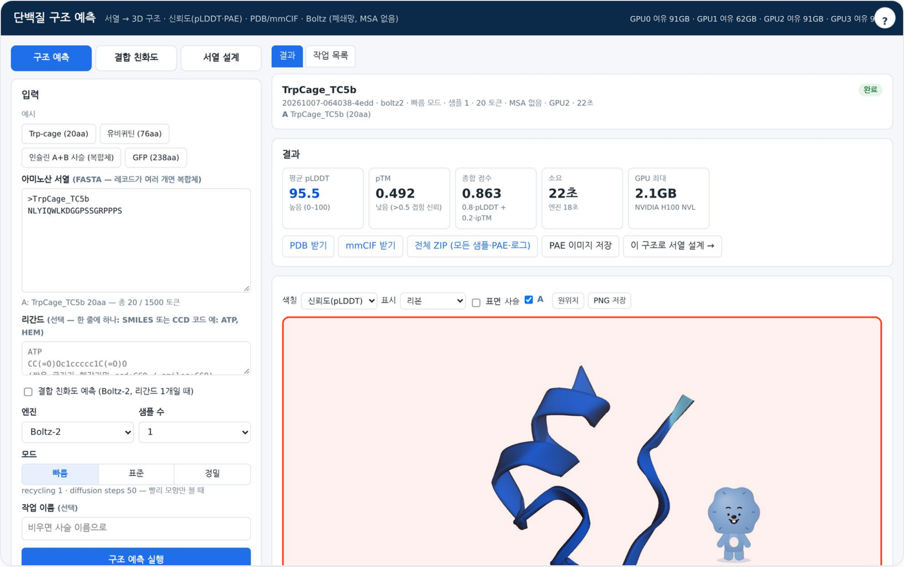
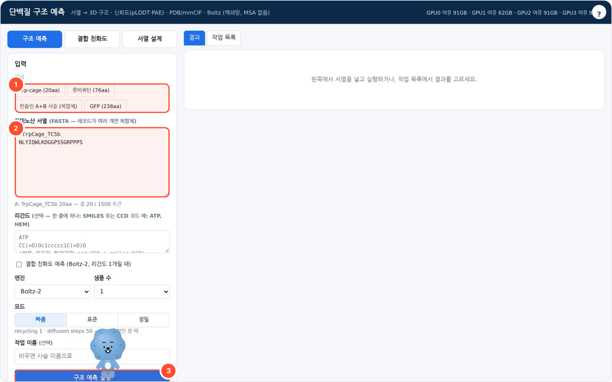

# protein-local — 단백질 구조 예측 · 결합 친화도 · 서열 설계

아미노산 서열(FASTA)을 넣으면 로컬 GPU 에서 Boltz-2 로 3D 구조(pLDDT·PAE)·결합 친화도를 예측하고, ProteinMPNN 으로 서열을 설계하는 로컬 웹 도구입니다. 포트 `8781`.



## 무엇을 하나

- 탭 3개: **구조 예측**(서열 → 3D 구조, 여러 사슬이면 복합체), **결합 친화도**(리간드 여러 개 순위 비교, Boltz-2), **서열 설계**(ProteinMPNN → 재예측 CA-RMSD 자체 검증).
- 결과는 3D 뷰어(pLDDT 색칠·사슬 선택), 잔기별 pLDDT 그래프, PAE 행렬, 사슬별 지표로 보여 주고 PDB / mmCIF / 전체 ZIP 으로 내려받습니다.
- 폐쇄망 전제 — **MSA 서버를 부르지 않는 단일 서열 모드**입니다. 3D 뷰어(3Dmol.js)는 동봉, CDN 없음. 작업은 GPU 1장에서 한 번에 1개씩 줄을 서고, 이력은 WORKSPACE 에 남습니다.
- 로컬 LLM(포털 기본: Ollama `gemma4:31b`)이 있으면 지표를 근거로 한 '결과 해설'을 씁니다.

## 사용 방법



1. **예시** 버튼(①: Trp-cage 20aa, 유비퀴틴 76aa, 인슐린 A+B 사슬, GFP 238aa)을 누르거나 서열을 직접 붙여 넣습니다.
2. **아미노산 서열**(②)은 FASTA 형식입니다. `>이름` 레코드가 여러 개면 복합체로 함께 예측합니다. 리간드(SMILES·CCD 코드)는 선택입니다.
3. 엔진(Boltz-2)·샘플 수·모드(빠름 / 표준 / 정밀)를 고르고 **구조 예측 실행**(③)을 누릅니다. 다른 작업이 돌고 있으면 줄을 서고, 진행 로그가 실시간으로 보입니다.
4. 결과 카드에서 평균 pLDDT·pTM·종합 점수·소요 시간·GPU 최대 메모리를 확인하고, 3D 뷰어(결과 화면 ①)에서 구조를 돌려 봅니다. **PDB 받기 / mmCIF 받기 / 전체 ZIP / PAE 이미지 저장**, 또는 **이 구조로 서열 설계 →** 로 이어 갑니다.

## 예시

포털 경유로 실제 실행한 결과입니다(2026-10-07, 작업 `20261007-064038-4edd`).

- **입력**: Trp-cage TC5b (20aa) `NLYIQWLKDGGPSSGRPPPS` · 엔진 Boltz-2 · 모드 빠름 · 샘플 1 · MSA 없음
- **출력**: 평균 pLDDT **95.5** · pTM **0.492** · 종합 점수 0.863 · 사슬 1개 · 소요 22초(엔진 18초) · GPU 최대 2.1GB (H100 NVL)

## 설치·실행

```bash
bash setup.sh                 # Python → Boltz 환경·가중치 확인 → GPU → LLM 탐색(선택) → selftest → http://localhost:8781
bash setup.sh stop
python3 app.py                # 수동 실행 (웹 서버는 표준 라이브러리만)
python3 selftest.py           # GPU·모델 없이 검증 (가짜 엔진, 임시 WORKSPACE)
```

| 환경변수 | 기본 | 설명 |
|---|---|---|
| `PORT` | `8781` | 0.0.0.0 바인딩 |
| `WORKSPACE` | `./_workspace` | `jobs/<id>/` — 입력 YAML·로그·원본 출력(`out/`)·`models/model_k.{pdb,cif}`·`result.json`·`explain.md` |
| `BOLTZ_ENV` | `~/miniforge3/envs/boltz` | boltz 패키지가 깔린 conda 환경 (그 `bin/python` 으로 `runner.py` 실행) |
| `MPNN_ENV` | `~/miniforge3/envs/proteinmpnn` | `ligandmpnn`(가중치 포함) 이 깔린 conda 환경 — 서열 설계 탭 |
| `BOLTZ_CACHE` | `~/.boltz` | `boltz2_conf.ckpt`, `boltz1_conf.ckpt`, `boltz2_aff.ckpt`, `mols/` (CCD) |
| `CUDA_VISIBLE_DEVICES` / `PROTEIN_GPUS` | (전부) | 쓸 GPU 목록. 작업마다 이 중 **여유 메모리가 가장 큰 1장**을 고름 |
| `GPU_PICK_HOLD_S` | `600` | 고른 GPU 에 작업 크기만큼 걸어 두는 예약 시간(작업이 끝나면 바로 풀림). 예약은 같은 서버의 다른 도구(`gpu_pick.py` 사용)와 같이 봐서, 거의 동시에 시작한 작업이 한 GPU 로 몰리지 않음 |
| `MAX_RES` | `1500` | 잔기 + 리간드 원자 합 한도 |
| `MAX_CHAINS` | `10` | 사슬 + 리간드 개수 한도 |
| `JOB_TIMEOUT` | `3600` | 작업 하나 최대 초 |
| `LLM_API` / `LLM_BASE_URL` / `LLM_MODEL` | `ollama` / `http://localhost:11434` / `qwen3:8b` | '결과 해설'에만 씀. 없으면 그 버튼만 실패. 포털로 띄우면 로컬 Ollama(`:11436`)의 `gemma4:31b` 가 넘어옴 |

## 구성
- `app.py` — HTTP 서버·작업 큐(워커 1개)·입력 검증·결과 파싱(PDB B 인자=pLDDT, `pae_*.npz` 를 표준 라이브러리로 읽음)·LLM 해설·CA 중첩 RMSD
- `gpu_pick.py` — GPU 고르기(여유 메모리 최대 + 도구 간 공유 예약, stdlib). 다른 도구 저장소와 같은 파일
- `runner.py` — Boltz 환경에서 실행: 리간드 사전 확인(RDKit) → `boltz predict`(같은 프로세스, `--no_kernels`) → GPU 최대 메모리 기록 → PDB→mmCIF(gemmi)
- `runner_mpnn.py` — proteinmpnn 환경에서 ProteinMPNN 실행 (가중치는 `ligandmpnn` 패키지에 동봉)
- `ui.html` — 탭 3개·대기열·진행 로그·3D 뷰어(pLDDT/사슬/이차구조/무지개, 리본·막대·표면, 사슬 켜고 끄기)·잔기별 pLDDT 그래프·PAE 히트맵·리간드 순위표·설계 서열 표·다운로드
- `static/3Dmol-min.js` — 3Dmol.js 2.5.5 (BSD-3, NOTICE)

### 결합 친화도 (Boltz-2)
리간드마다 복합체 YAML 을 따로 만들어 `boltz predict` 에 **폴더로** 넘기고(한 번 적재로 전부 처리), 결과를 순위표로 모읍니다.
Boltz 가 내놓는 두 값의 뜻은 Boltz 공식 README 의 "Binding Affinity Prediction" 을 그대로 따릅니다:
- `affinity_probability_binary` (0–1) — **결합체일 확률**. 결합체/미끼 구분 = 히트 발굴 단계
- `affinity_pred_value` — **log10(IC50), IC50 단위 μM**. 결합체들 사이의 세기 비교 = 히트→리드·리드 최적화 단계.
  화면에는 IC50(μM) 과 pIC50(= 6 − log10(IC50[μM])) 으로도 보여 줍니다
읽을 수 없는 SMILES·무거운 원자 128개 초과(Boltz 친화도 제한) 리간드는 **그것만 건너뛰고** 나머지를 계속 돌립니다.

### 서열 설계 (ProteinMPNN)
`mpnn --model_type protein_mpnn|soluble_mpnn --fixed_residues … --chains_to_design …` 을 돌리고 FASTA 헤더에서
`overall_confidence`·`seq_rec` 를 읽고, `--save_stats` 로 남는 `log_probs` 에서 두 점수를 다시 계산합니다:
- **score** — 설계한 잔기(`mask × chain_mask`) 평균 음의 로그확률. FASTA 헤더의 `−ln(overall_confidence)` 와 같아야 하며, 2e-3 넘게 어긋나면 작업을 실패시킵니다(순서 대응 사고 방지)
- **global_score** — 같은 값을 모든 잔기(`mask`)로. 고정 잔기가 많을수록 score 와 벌어집니다
입력 구조는 PDB 와 **mmCIF**(Boltz 환경의 gemmi 로 PDB 변환, 리간드·물 제거) 를 받습니다.
**재예측 검증**: 고른 설계(와 원서열 기준선)를 구조 예측 작업으로 다시 걸고, 나온 구조를 원구조와 CA 기준으로 겹쳐 **RMSD** 를 냅니다.
중첩은 Horn 사원수법(표준 라이브러리만)으로 구현했고, numpy SVD Kabsch 와 1e-6 이내로 일치하는 것을 selftest 에서 확인합니다.

## 모드
| 모드 | recycling | diffusion steps | 용도 |
|---|---|---|---|
| 빠름 | 1 | 50 | 모양만 빨리 |
| 표준 | 3 | 200 | Boltz 기본값 |
| 정밀 | 10 | 200 | 조금 더 시간 |

샘플 수(1–5)를 늘리면 여러 구조를 뽑아 Boltz 의 종합 점수(0.8·pLDDT + 0.2·ipTM) 순으로 보여 줍니다.

## 이 서버에서 잰 값 (2026-10-06, H100 NVL, Boltz 2.2.1, MSA 없음, 앱을 통해 실행)
| 입력 | 모드·샘플 | 토큰 | 소요(전체) | GPU 최대 | 평균 pLDDT | pTM / ipTM |
|---|---|---|---|---|---|---|
| 유비퀴틴 76aa | 표준·1 | 76 | 24초 | 2.2GB | 92.9 | 0.916 / – |
| 유비퀴틴 × 리간드 3종 (친화도) | 표준 | 116 | 83초 | 2.3GB | – | 아래 표 |
| 인슐린 A(21)+B(30) | 표준·3 | 51 | 35초 | 2.1GB | 87.5 | 0.890 / 0.890 (사슬 간 PAE 2.5Å) |
| 유비퀴틴 + ATP, 친화도 | 빠름·1 | 107 | 44초 | 2.3GB | 94.4 | 0.815 / 0.501 |
| GFP 238aa × 6 | 표준·1 | 1428 | 282초 | 24.5GB | 58.6 | 0.273 / 0.212 |

| 인슐린 예측구조 → 서열 16개 (설계) | T=0.1 | 51잔기 | 2.3초 | 0.24GB | – | 회수율 평균 47.9% |
| 유비퀴틴 예측구조 → 서열 4개 (설계) | T=0.1 | 76잔기 | 2.5초 | 0.13GB | – | 회수율 평균 56.6% |
| 위 설계 1번 재예측 검증 | 표준 | 76 | 30초 안팎 | 2.2GB | 93.6 | **RMSD 1.55 Å** |
| 설계 2개 + 원서열 재예측 검증 | 표준 | 51 | 각 30초 안팎 | 2.1GB | 86~90 | RMSD 0.34(원서열) / 1.05 / 1.08 Å |

친화도 예시 결과(유비퀴틴 — 실제 결합 단백질이 아니라 경로 확인용): ATP 결합확률 0.427·IC50 6.1μM, 아스피린 0.375·152μM, 에탄올 0.066·201μM.
리간드 pLDDT 가 28~35 로 낮아 결합 자세는 신뢰도가 낮습니다 — 화면에서도 그 수치를 붉게 표시합니다.

시간의 대부분은 모델 적재(약 15초)와 diffusion 입니다. `MAX_RES=1500` 은 위 GFP×6 줄(약 25GB)에 여유를 둔 값입니다.

## 한계 — 꼭 읽기
- **MSA 없음**: 폐쇄망이라 ColabFold MSA 서버(`--use_msa_server`)를 쓰지 않습니다. 입력 YAML 의 모든 단백질이 `msa: empty`.
  잘 알려진 작은 단백질(유비퀴틴 등)은 높게 나오지만, 진화 정보가 필요한 단백질(GFP 등)은 pLDDT 가 낮고 실제와 다를 수 있습니다.
  로컬 MSA(a3m)를 붙이려면 `build_yaml()` 에서 `msa: <경로>` 로 바꾸면 됩니다(Boltz 가 지원).
- **ESMFold 미노출**: `esmfold` conda 환경은 있으나 ESMFold 3B 가중치(`esmfold_3B_v1.pt`, 약 2.7GB + ESM-2 3B 약 5GB)가 이 서버에 없어 엔진 목록에서 뺐습니다.
- 표준 아미노산 20종만 받습니다(X·B·Z·U·O 거부). DNA/RNA·수식 잔기·공유결합 리간드는 화면에서 지원하지 않습니다(Boltz 자체는 지원).
- 결합 친화도는 Boltz-2 의 예측치로 히트 선별용 상대 지표입니다. 실측값이 아니고, 단백질 구조가 MSA 없이 예측된 것이라 더 흔들립니다.
  친화도 예측은 리간드 1개당 따로 돌아가므로 리간드 수에 비례해 시간이 늡니다(한 번에 최대 20개).
- ProteinMPNN 은 **백본 구조만** 보고 서열을 고릅니다. 기능(활성 부위·결합 잔기·안정성)은 모르므로 꼭 지킬 잔기는 고정해야 하고,
  재예측 RMSD 가 낮다고 해서 실제로 발현·접힘·기능이 보장되지는 않습니다.
- 재예측 검증은 MSA 없는 Boltz 예측으로 돌아가므로 RMSD 도 참고치입니다. 원서열 기준선과 견주어 보세요.
- cuequivariance 커널이 이 환경에서 import 되지 않아 `--no_kernels` 로 돌립니다(조금 느리고 메모리를 더 씀).
- GPU 는 Ollama 등 다른 프로세스와 같이 씁니다. 메모리 부족이면 작업이 '실패'로 끝나고 이유가 표시됩니다.

## 폐쇄망 설치
1. 인터넷 되는 곳에서 `pip install boltz` 한 conda 환경과 `~/.boltz`(`boltz predict` 를 한 번 돌리면 받아짐: ckpt·`ccd.pkl`·`mols/`)를 만들어 통째로 복사
2. 이 폴더를 복사 → `bash setup.sh`

## 출처·감사 (Credits)

- 동봉: [3Dmol.js](https://github.com/3dmol/3Dmol.js) 2.5.5 (BSD-3-Clause, `static/3Dmol.LICENSE.txt` — GLmol·Three.js·jQuery 포함)
- [Boltz (Boltz-1 / Boltz-2)](https://github.com/jwohlwend/boltz) (MIT, 가중치 포함) — 구조·결합 친화도 예측. 서버에 따로 설치
- [ProteinMPNN](https://github.com/dauparas/ProteinMPNN) / [LigandMPNN](https://github.com/dauparas/LigandMPNN) (MIT) — 서열 설계. 인용: Dauparas et al., *Science* (2022)
- RDKit (BSD-3-Clause), gemmi (MPL-2.0) — Boltz 환경 의존성
- 예시 서열은 공개 서열(UniProt P0CG48, P01308, P42212, Trp-cage TC5b), 예시 리간드는 CCD 코드·공개 SMILES
- **LLM 실행** — OpenAI 호환 API 로 호출합니다(모델 가중치는 동봉하지 않음). 기본 배포는 [Ollama](https://github.com/ollama/ollama) (MIT) 위의 Google [Gemma](https://ai.google.dev/gemma) `gemma4:31b` — 모델 이용 조건은 Gemma 배포처 참고.
- 이 도구는 [agent-page-portal](https://github.com/gggg8657/agent-page-portal) 에 연결해 쓰도록 만들었습니다(단독 실행도 됨).

저작권 표기·전체 목록은 `NOTICE` 를 보세요.

## 라이선스

MIT License — Copyright (c) 2026 DongJu Kim (gggg8657). `LICENSE` 를 보세요.
